<!-- Generated by GitHub Profile Agent Console. Edit profile.config.json, then run npm run generate. -->

  <picture>
    <source media="(max-width: 760px) and (prefers-color-scheme: dark)" srcset="./assets/hero/agent-console-baafb74e-mobile-dark.svg">
    <source media="(max-width: 760px)" srcset="./assets/hero/agent-console-baafb74e-mobile-light.svg">
    <source media="(prefers-color-scheme: dark)" srcset="./assets/hero/agent-console-baafb74e-dark.svg">
    <source media="(prefers-color-scheme: light)" srcset="./assets/hero/agent-console-baafb74e-light.svg">
    
  </picture>

  
  
  

## Featured Work

| Project | Focus | Why it matters |
| --- | --- | --- |
| [**Mulungs Super App**](https://play.google.com/store/apps/details?id=com.indoditi.mulungs_user) | Waste Management Ecosystem | An innovative mobile app bridging environmental awareness with digital financial inclusion by enabling users to convert waste into digital credit. [Live](https://mulungs.com/) |

<!-- CUSTOM:START -->
<!-- You can add custom markdown here. It will be preserved during generation. -->
<h2 align="left">✨ My Stacks and Stats</h2>
 

<!-- https://github-readme-stats-eight-theta.vercel.app/api?username=taufiqrhmd&show_icons=true&theme=tokyonight&include_all_commits=true&count_private=true" alt="Taufiq's GitHub Stats" />
   -->

      
  

<!--   -->

<!-- <h2 align="left">✉️ Let's Connect</h2>

  
  
  

  

 -->

<!--   -->
<!-- CUSTOM:END -->

---

<!-- 

  Building thoughtful systems and sharing what works.

 -->
